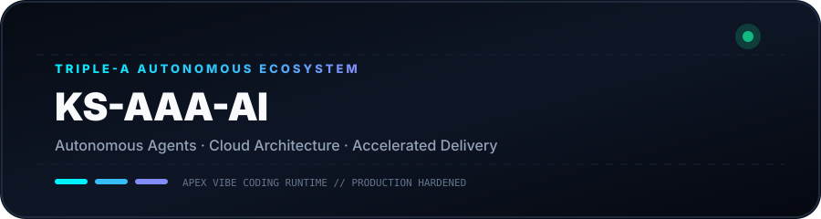

<div align="center">

<p>
  
  
</p>

# KS-AAA-AI

<p>
  <strong>Architecting Autonomous AI Pipelines, Resilient Workflows &amp; Ultra-Fast Cloud Systems.</strong><br />
  <sub>Triple-A Core: Autonomous · Architecture · Acceleration</sub>
</p>

<p>
  
  
  
  
</p>

</div>

---

<p align="center">
  
</p>

---

### 💡 Triple-A Engineering Ethos

- **🤖 Autonomous Intelligence**  
  무인 자율 에이전트 루프와 지능형 툴 콜링 파이프라인을 구축하여, 아이디어 기획부터 코드 배포까지 마찰 없는 완전 자동화를 실현합니다.

- **🏛️ Resilient Architecture**  
  클린 디커플링, 무상태(Stateless) 마이크로서비스, 단일장애점(Zero-SPOF) 없는 다중 계정 쿼터 페일오버 토폴로지를 설계합니다.

- **⚡ Accelerated Delivery**  
  군더더기 없는 미니멀 코드 철학(Ponytail)과 즉각적인 프로토타이핑으로 신속하고 검증된 프로덕션 산출물을 완성합니다.

---

### 🚀 Featured System: [github-org-map](https://github.com/KS-AAA-AI/github-org-map)

> **Autonomous Daily Repository Cartography & Topology Engine (v3.0)**  
> 생태계 내 모든 리포지토리를 자율 탐색하고, 비공개 프로젝트를 **HMAC-SHA256 영지식(Zero-Knowledge)** 기술로 안전하게 보호하면서 실시간 벡터 HUD 및 모션 텔레메트리를 생성합니다.

- **🔄 무인 자동화**: GitHub Actions를 통한 일일 정기 스케줄 토폴로지 히스토리 누적
- **🛡️ 프라이버시 보호**: `APEX-VAULT` 해시 라벨링으로 비공개 식별자 유출 원천 차단
- **🎨 다이나믹 렌더링**: 네온 사이버펑크 벡터 SVG 및 스캔 레이더 GIF 실시간 생성

---

### ⚡ Technology Stack

```
[Languages]   TypeScript · Python · Go · JavaScript · Bash / PowerShell
[Runtimes]    Node.js · Bun · Deno · Python 3.12+
[Cloud & CI]  GitHub Actions · Docker · Cloudflare Workers / D1 · Vercel
[Engineering] Vibe Coding · Agentic Automation · HMAC-SHA256 Cryptography
```

---

<div align="center">

### 📬 Connect &amp; Inquiries

[GitHub Profile](https://github.com/KS-AAA-AI) · [github-org-map](https://github.com/KS-AAA-AI/github-org-map) · [Email](mailto:jo9605208@gmail.com)

<sub>Copyright © 2026 KS-AAA-AI. All rights reserved.</sub>

</div>
