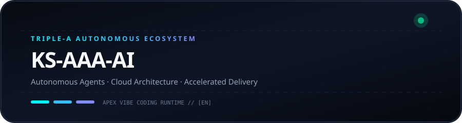
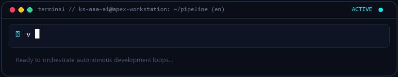
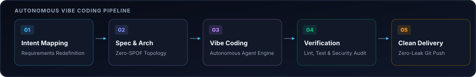
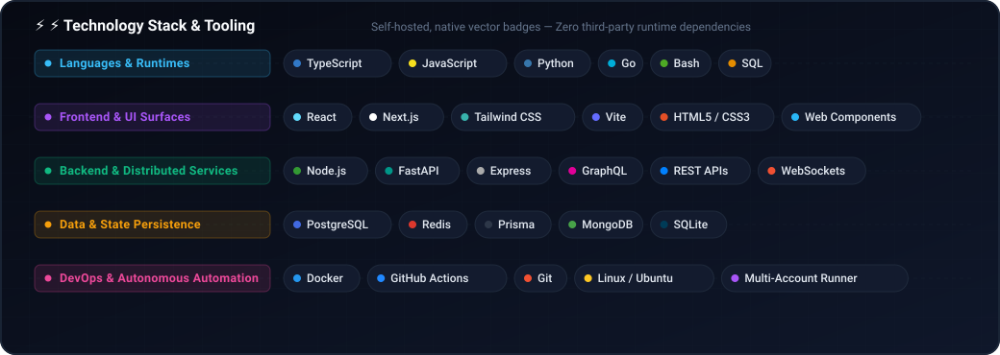

  
  

# KS-AAA-AI

  <strong>Architecting Autonomous AI Pipelines, Resilient Workflows & Ultra-Fast Cloud Systems.</strong> 
  Triple-A Core: Autonomous · Architecture · Acceleration

  **🇺🇸 English** · [🇰🇷 한국어](locales/ko.md) · [🇨🇳 中文](locales/zh-CN.md) · [🇪🇸 Español](locales/es.md) · [🇮🇳 हिन्दी](locales/hi.md) 
  [🇸🇦 العربية](locales/ar.md) · [🇧🇷 Português](locales/pt-BR.md) · [🇷🇺 Русский](locales/ru.md) · [🇫🇷 Français](locales/fr.md) · [🇮🇩 Bahasa Indonesia](locales/id.md)

  
  
  
  

---

<h3 style="display:inline-block; margin:0; cursor:pointer;">💡 About & Triple-A Engineering Ethos</h3>

 

  

#### 🤖 Autonomous Intelligence
Building zero-friction autonomous agent loops and tool-calling execution engines from ideation to production deployment.

#### 🏛️ Resilient Architecture
Designing decoupled microservices, stateless runtimes, and zero-SPOF multi-account quota failover topologies.

#### ⚡ Accelerated Delivery
Minimalist code philosophy (Ponytail) combined with instant vibe coding workflows for battle-tested deliverables.

  

---

<h3 style="display:inline-block; margin:0; cursor:pointer;">🚀 Featured System: github-org-map</h3>

 

> **[github-org-map](https://github.com/KS-AAA-AI/github-org-map)**  
> Autonomous daily cartography and topology engine mapping ecosystem repositories with zero-knowledge HMAC-SHA256 privacy preservation.

- **🔄 Automation**: GitHub Actions scheduled daily autonomous cartography
- **🛡️ Zero-Leakage Privacy**: HMAC-SHA256 APEX-VAULT encrypted identifier masking
- **🎨 Visual Telemetry**: Cyberpunk Vector SVG & scanning radar GIF generation
- **⚡ Independent Engine**: Custom TypeScript 5.6 engine without external duplication

  👉 <a href="https://github.com/KS-AAA-AI/github-org-map">Explore Repository</a>

  

---

<h3 style="display:inline-block; margin:0; cursor:pointer;">⚡ Technology Stack & Protocols</h3>

 

`
[Languages]   TypeScript · Python · Go · JavaScript · Bash / PowerShell
[Runtimes]    Node.js · Bun · Deno · Python 3.12+
[Cloud & CI]  GitHub Actions · Docker · Cloudflare Workers / D1 · Vercel
[Engineering] Vibe Coding · Agentic Automation · HMAC-SHA256 Cryptography
`

  

---

<h3 style="display:inline-block; margin:0; cursor:pointer;">📬 Connect & Inquiries</h3>

 

Interested in autonomous software architectures, engineering collaboration, or innovative system designs?

  <a href="https://github.com/KS-AAA-AI">GitHub Profile</a> · 
  <a href="https://github.com/KS-AAA-AI/github-org-map">github-org-map</a> · 
  <a href="mailto:jo9605208@gmail.com">Send an Email</a>

Copyright © 2026 KS-AAA-AI. All rights reserved.

