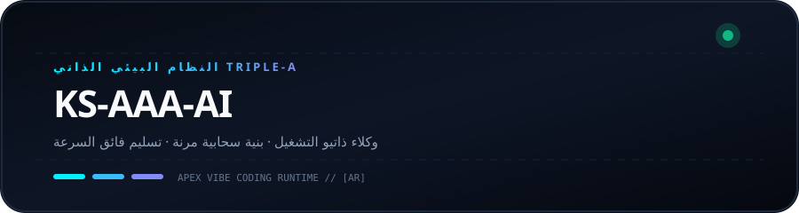
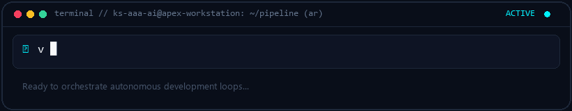

  
  

# KS-AAA-AI

  <strong>هندسة خطوط أنابيب الذكاء الاصطناعي الذاتية وسير العمل المرن والأنظمة السحابية فائقة السرعة.</strong> 
  نواة Triple-A: ذاتية التشغيل · بنية سحابية · تسليم فائق السرعة

  [🇺🇸 English](../README.md) · [🇰🇷 한국어](ko.md) · [🇨🇳 中文](zh-CN.md) · [🇪🇸 Español](es.md) · [🇮🇳 हिन्दी](hi.md) 
  **🇸🇦 العربية** · [🇧🇷 Português](pt-BR.md) · [🇷🇺 Русский](ru.md) · [🇫🇷 Français](fr.md) · [🇮🇩 Bahasa Indonesia](id.md)

  
  
  
  

---

<h3 style="display:inline-block; margin:0; cursor:pointer;">💡 فلسفة الهندسة ونواة Triple-A</h3>

 

  

#### 🤖 الذكاء الذاتي
بناء حلقات وكلاء مستقلة وخالية من الاحتكاك ومحركات استدعاء الأدوات من الفكرة إلى النشر.

#### 🏛️ بنية مرنة وقوية
تصميم خدمات مصغرة مستقلة وتوزيع أحمال متعدد الحسابات بدون أي نقطة فشل فردية.

#### ⚡ تسليم فائق السرعة
فلسفة برمجية مبسطة وسريعة لتقديم مخرجات إنتاج موثوقة ومثبتة.

---

<h3 style="display:inline-block; margin:0; cursor:pointer;">🚀 النظام المميز: github-org-map</h3>

 

> **[github-org-map](https://github.com/KS-AAA-AI/github-org-map)**  
> محرك خرائط وتخطيط يومي للبرمجيات مع تشفير الأمان التام HMAC-SHA256 للحفاظ على الخصوصية.

- **🔄 Automation**: GitHub Actions scheduled daily autonomous cartography
- **🛡️ Zero-Leakage Privacy**: HMAC-SHA256 APEX-VAULT encrypted identifier masking
- **🎨 Visual Telemetry**: Cyberpunk Vector SVG & scanning radar GIF generation
- **⚡ Independent Engine**: Custom TypeScript 5.6 engine without external duplication

  👉 <a href="https://github.com/KS-AAA-AI/github-org-map">Explore Repository</a>

---

<h3 style="display:inline-block; margin:0; cursor:pointer;">⚡ حزمة التكنولوجيا والبروتوكولات</h3>

 

`
[Languages]   TypeScript · Python · Go · JavaScript · Bash / PowerShell
[Runtimes]    Node.js · Bun · Deno · Python 3.12+
[Cloud & CI]  GitHub Actions · Docker · Cloudflare Workers / D1 · Vercel
[Engineering] Vibe Coding · Agentic Automation · HMAC-SHA256 Cryptography
`

---

<h3 style="display:inline-block; margin:0; cursor:pointer;">📬 التواصل والاستفسارات</h3>

 

هل ترغب في مناقشة بنيات البرمجيات الذاتية أو التعاون الهندسي؟

  <a href="https://github.com/KS-AAA-AI">GitHub Profile</a> · 
  <a href="https://github.com/KS-AAA-AI/github-org-map">github-org-map</a> · 
  <a href="mailto:jo9605208@gmail.com">Send an Email</a>

Copyright © 2026 KS-AAA-AI. All rights reserved.

