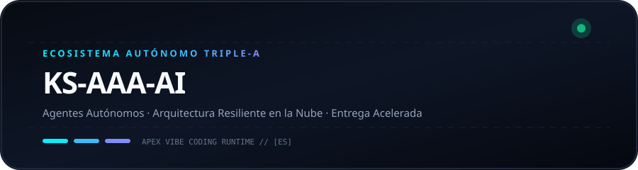
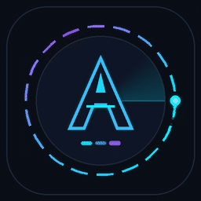
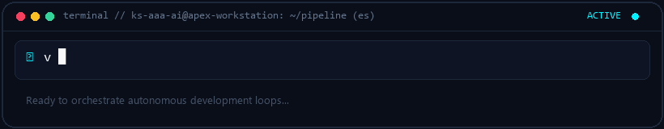
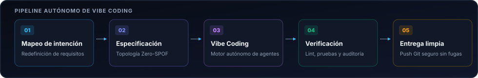

  <picture>
    
  </picture>
  <picture>
    
  </picture>

# KS-AAA-AI

  <strong>Arquitectura de tuberías de IA autónomas, flujos de trabajo resilientes y sistemas en la nube ultra rápidos.</strong> 
  Núcleo Triple-A: Autónomo · Arquitectura · Aceleración

  <a href="../README.md">🇺🇸 English</a> · <a href="ko.md">🇰🇷 한국어</a> · <a href="zh-CN.md">🇨🇳 中文</a> · <strong>🇪🇸 Español</strong> · <a href="hi.md">🇮🇳 हिन्दी</a> 
  <a href="ar.md">🇸🇦 العربية</a> · <a href="pt-BR.md">🇧🇷 Português</a> · <a href="ru.md">🇷🇺 Русский</a> · <a href="fr.md">🇫🇷 Français</a> · <a href="id.md">🇮🇩 Bahasa Indonesia</a>

  
  
  
  

---

<h3 style="display:inline-block; margin:0; cursor:pointer;">💡 Filosofía de Ingeniería y Núcleo Triple-A</h3>

 

  <picture>
    
  </picture>

#### 🤖 Inteligencia Autónoma
Construcción de bucles de agentes autónomos y motores de herramientas sin fricciones desde la idea hasta el despliegue.

#### 🏛️ Arquitectura Resiliente
Diseño de microservicios desacoplados y topologías tolerantes a fallos con rotación de cuotas multi-cuenta.

#### ⚡ Entrega Acelerada
Filosofía de código minimalista combinada con flujos de desarrollo ágiles para resultados probados en producción.

  

---

<h3 style="display:inline-block; margin:0; cursor:pointer;">🚀 Sistema Destacado: github-org-map</h3>

 

> **[github-org-map](https://github.com/KS-AAA-AI/github-org-map)**  
> Motor de cartografía y topología diaria que mapea repositorios con preservación de privacidad HMAC-SHA256.

- **🔄 Automation**: GitHub Actions scheduled daily autonomous cartography
- **🛡️ Zero-Leakage Privacy**: HMAC-SHA256 APEX-VAULT encrypted identifier masking
- **🎨 Visual Telemetry**: Cyberpunk Vector SVG & scanning radar GIF generation
- **⚡ Independent Engine**: Custom TypeScript 5.6 engine without external duplication

  👉 <a href="https://github.com/KS-AAA-AI/github-org-map">Explore Repository</a>

  

---

<h3 style="display:inline-block; margin:0; cursor:pointer;">⚡ Pila Tecnológica y Protocolos</h3>

 

`
[Languages]   TypeScript · Python · Go · JavaScript · Bash / PowerShell
[Runtimes]    Node.js · Bun · Deno · Python 3.12+
[Cloud & CI]  GitHub Actions · Docker · Cloudflare Workers / D1 · Vercel
[Engineering] Vibe Coding · Agentic Automation · HMAC-SHA256 Cryptography
`

  

---

<h3 style="display:inline-block; margin:0; cursor:pointer;">📬 Contacto y Colaboración</h3>

 

¿Interesado en arquitecturas de software autónomas o colaboración en ingeniería?

  <a href="https://github.com/KS-AAA-AI">GitHub Profile</a> · 
  <a href="https://github.com/KS-AAA-AI/github-org-map">github-org-map</a> · 
  <a href="mailto:jo9605208@gmail.com">Send an Email</a>

Copyright © 2026 KS-AAA-AI. All rights reserved.

