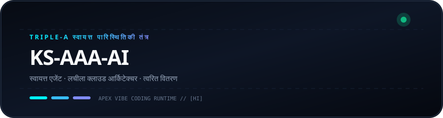
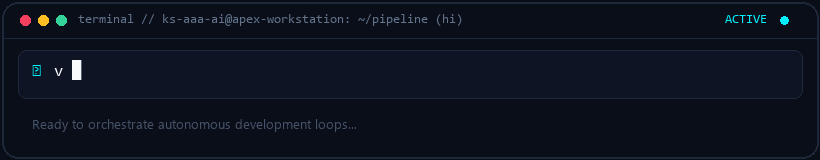
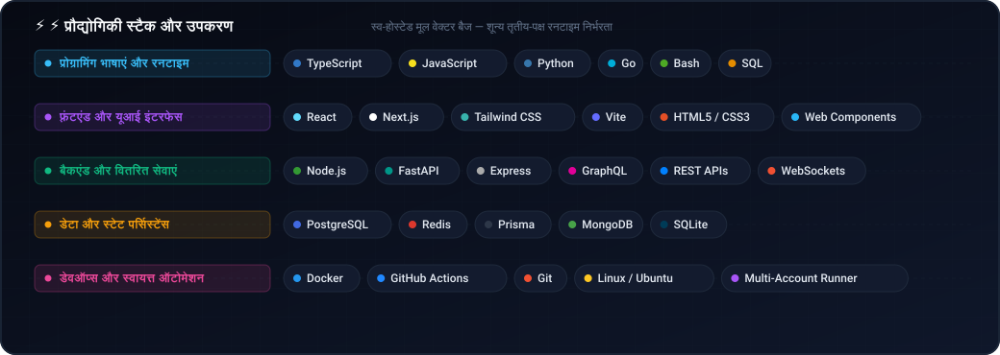

  <picture>
    
  </picture>
  <picture>
    
  </picture>

# KS-AAA-AI

  <strong>स्वायत्त एआई पाइपलाइन, लचीले वर्कफ़्लो और अत्यधिक तेज़ क्लाउड सिस्टम का निर्माण।</strong> 
  Triple-A कोर: स्वायत्त · आर्किटेक्चर · त्वरित

  [🇺🇸 English](../README.md) · [🇰🇷 한국어](ko.md) · [🇨🇳 中文](zh-CN.md) · [🇪🇸 Español](es.md) · **🇮🇳 हिन्दी** 
  [🇸🇦 العربية](ar.md) · [🇧🇷 Português](pt-BR.md) · [🇷🇺 Русский](ru.md) · [🇫🇷 Français](fr.md) · [🇮🇩 Bahasa Indonesia](id.md)

  
  
  
  

---

<h3 style="display:inline-block; margin:0; cursor:pointer;">💡 इंजीनियरिंग लोकाचार और Triple-A कोर</h3>

 

  <picture>
    
  </picture>

#### 🤖 स्वायत्त बुद्धि (Autonomous Intelligence)
विचार से उत्पादन तक पूर्ण स्वचालन के लिए स्वायत्त एजेंट लूप और टूल-कॉलिंग पाइपलाइनों का निर्माण।

#### 🏛️ लचीला आर्किटेक्चर (Resilient Architecture)
डिकपल्ड माइक्रोसर्विसेज और शून्य-एसपीओएफ मल्टी-अकाउंट कोटा फ़ेलओवर टोपोलॉजी का डिज़ाइन।

#### ⚡ त्वरित वितरण (Accelerated Delivery)
तेज़ और सत्यापित उत्पादन आउटपुट के लिए न्यूनतम कोड दर्शन।

  

---

<h3 style="display:inline-block; margin:0; cursor:pointer;">🚀 प्रमुख प्रणाली: github-org-map</h3>

 

> **[github-org-map](https://github.com/KS-AAA-AI/github-org-map)**  
> HMAC-SHA256 शून्य-ज्ञान गोपनीयता संरक्षण के साथ स्वचालित दैनिक रिपॉजिटरी कार्टोग्राफी इंजन।

- **🔄 Automation**: GitHub Actions scheduled daily autonomous cartography
- **🛡️ Zero-Leakage Privacy**: HMAC-SHA256 APEX-VAULT encrypted identifier masking
- **🎨 Visual Telemetry**: Cyberpunk Vector SVG & scanning radar GIF generation
- **⚡ Independent Engine**: Custom TypeScript 5.6 engine without external duplication

  👉 <a href="https://github.com/KS-AAA-AI/github-org-map">Explore Repository</a>

  

---

<h3 style="display:inline-block; margin:0; cursor:pointer;">⚡ प्रौद्योगिकी स्टैक और प्रोटोकॉल</h3>

 

`
[Languages]   TypeScript · Python · Go · JavaScript · Bash / PowerShell
[Runtimes]    Node.js · Bun · Deno · Python 3.12+
[Cloud & CI]  GitHub Actions · Docker · Cloudflare Workers / D1 · Vercel
[Engineering] Vibe Coding · Agentic Automation · HMAC-SHA256 Cryptography
`

  

---

<h3 style="display:inline-block; margin:0; cursor:pointer;">📬 संपर्क और सहयोग</h3>

 

स्वायत्त सॉफ्टवेयर आर्किटेक्चर या सिस्टम डिजाइन में रुचि रखते हैं?

  <a href="https://github.com/KS-AAA-AI">GitHub Profile</a> · 
  <a href="https://github.com/KS-AAA-AI/github-org-map">github-org-map</a> · 
  <a href="mailto:jo9605208@gmail.com">Send an Email</a>

Copyright © 2026 KS-AAA-AI. All rights reserved.

