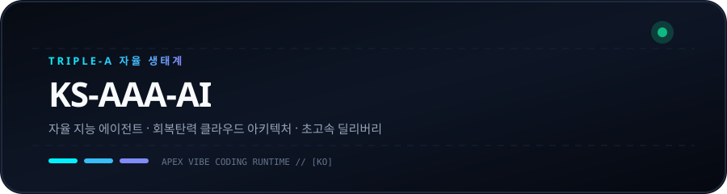
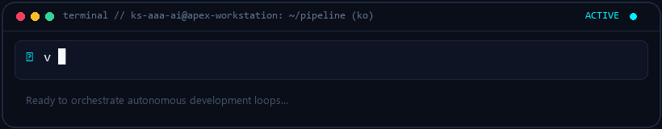

  
  

# KS-AAA-AI

  <strong>자율형 AI 파이프라인, 회복탄력적 워크플로 및 초고속 클라우드 시스템 설계.</strong> 
  Triple-A 핵심 가치: 자율성 · 아키텍처 · 가속화

  [🇺🇸 English](../README.md) · **🇰🇷 한국어** · [🇨🇳 中文](zh-CN.md) · [🇪🇸 Español](es.md) · [🇮🇳 हिन्दी](hi.md) 
  [🇸🇦 العربية](ar.md) · [🇧🇷 Português](pt-BR.md) · [🇷🇺 Русский](ru.md) · [🇫🇷 Français](fr.md) · [🇮🇩 Bahasa Indonesia](id.md)

  
  
  
  

---

<h3 style="display:inline-block; margin:0; cursor:pointer;">💡 핵심 가치 및 Triple-A 엔지니어링 지향점</h3>

 

  

#### 🤖 자율 지능 (Autonomous Intelligence)
무인 자율 에이전트 루프와 지능형 툴 콜링 파이프라인을 구축하여 기획부터 배포까지 마찰 없는 완전 자동화를 실현합니다.

#### 🏛️ 회복탄력 아키텍처 (Resilient Architecture)
클린 디커플링, 무상태 마이크로서비스, 단일장애점 없는 다중 계정 쿼터 페일오버 토폴로지를 구축합니다.

#### ⚡ 가속화 딜리버리 (Accelerated Delivery)
군더더기 없는 미니멀 코드 철학(Ponytail)과 즉각적인 프로토타이핑으로 신속하고 검증된 프로덕션 산출물을 완성합니다.

  

---

<h3 style="display:inline-block; margin:0; cursor:pointer;">🚀 주요 대표 시스템: github-org-map</h3>

 

> **[github-org-map](https://github.com/KS-AAA-AI/github-org-map)**  
> 생태계 내 모든 리포지토리를 자율 탐색하고, 비공개 프로젝트를 HMAC-SHA256 영지식 기술로 안전하게 보호하는 독자적 토폴로지 엔진 (v3.0).

- **🔄 Automation**: GitHub Actions scheduled daily autonomous cartography
- **🛡️ Zero-Leakage Privacy**: HMAC-SHA256 APEX-VAULT encrypted identifier masking
- **🎨 Visual Telemetry**: Cyberpunk Vector SVG & scanning radar GIF generation
- **⚡ Independent Engine**: Custom TypeScript 5.6 engine without external duplication

  👉 <a href="https://github.com/KS-AAA-AI/github-org-map">Explore Repository</a>

  

---

<h3 style="display:inline-block; margin:0; cursor:pointer;">⚡ 기술 스택 및 프로토콜</h3>

 

`
[Languages]   TypeScript · Python · Go · JavaScript · Bash / PowerShell
[Runtimes]    Node.js · Bun · Deno · Python 3.12+
[Cloud & CI]  GitHub Actions · Docker · Cloudflare Workers / D1 · Vercel
[Engineering] Vibe Coding · Agentic Automation · HMAC-SHA256 Cryptography
`

  

---

<h3 style="display:inline-block; margin:0; cursor:pointer;">📬 문의 및 협업 연결</h3>

 

자율형 소프트웨어 아키텍처, 엔지니어링 협업 또는 혁신적인 시스템 설계에 관심이 있으신가요?

  <a href="https://github.com/KS-AAA-AI">GitHub Profile</a> · 
  <a href="https://github.com/KS-AAA-AI/github-org-map">github-org-map</a> · 
  <a href="mailto:jo9605208@gmail.com">Send an Email</a>

Copyright © 2026 KS-AAA-AI. All rights reserved.

