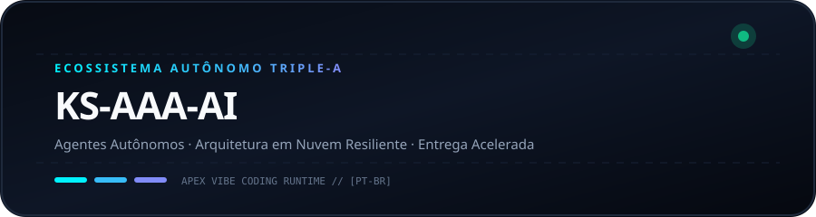
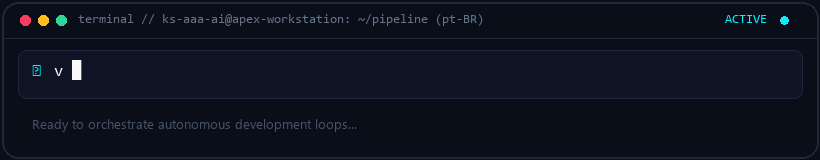

  <picture>
    
  </picture>
  <picture>
    
  </picture>

# KS-AAA-AI

  <strong>Arquitetando pipelines autônomos de IA, fluxos resilientes e sistemas em nuvem ultra rápidos.</strong> 
  Núcleo Triple-A: Autonomia · Arquitetura · Aceleração

  [🇺🇸 English](../README.md) · [🇰🇷 한국어](ko.md) · [🇨🇳 中文](zh-CN.md) · [🇪🇸 Español](es.md) · [🇮🇳 हिन्दी](hi.md) 
  [🇸🇦 العربية](ar.md) · **🇧🇷 Português** · [🇷🇺 Русский](ru.md) · [🇫🇷 Français](fr.md) · [🇮🇩 Bahasa Indonesia](id.md)

  
  
  
  

---

<h3 style="display:inline-block; margin:0; cursor:pointer;">💡 Filosofia de Engenharia e Núcleo Triple-A</h3>

 

  <picture>
    
  </picture>

#### 🤖 Inteligência Autônoma
Construção de loops de agentes autônomos e execução de chamadas de ferramentas da concepção ao deploy.

#### 🏛️ Arquitetura Resiliente
Projeto de microsserviços desacoplados e topologias sem ponto único de falha com failover multi-contas.

#### ⚡ Entrega Acelerada
Filosofia de código minimalista combinada com fluxos rápidos para entregáveis robustos em produção.

  

---

<h3 style="display:inline-block; margin:0; cursor:pointer;">🚀 Sistema em Destaque: github-org-map</h3>

 

> **[github-org-map](https://github.com/KS-AAA-AI/github-org-map)**  
> Motor diário de cartografia e topologia com preservação de privacidade de conhecimento zero HMAC-SHA256.

- **🔄 Automation**: GitHub Actions scheduled daily autonomous cartography
- **🛡️ Zero-Leakage Privacy**: HMAC-SHA256 APEX-VAULT encrypted identifier masking
- **🎨 Visual Telemetry**: Cyberpunk Vector SVG & scanning radar GIF generation
- **⚡ Independent Engine**: Custom TypeScript 5.6 engine without external duplication

  👉 <a href="https://github.com/KS-AAA-AI/github-org-map">Explore Repository</a>

  

---

<h3 style="display:inline-block; margin:0; cursor:pointer;">⚡ Pilha Tecnológica e Protocolos</h3>

 

`
[Languages]   TypeScript · Python · Go · JavaScript · Bash / PowerShell
[Runtimes]    Node.js · Bun · Deno · Python 3.12+
[Cloud & CI]  GitHub Actions · Docker · Cloudflare Workers / D1 · Vercel
[Engineering] Vibe Coding · Agentic Automation · HMAC-SHA256 Cryptography
`

  

---

<h3 style="display:inline-block; margin:0; cursor:pointer;">📬 Contato e Conexões</h3>

 

Interessado em arquiteturas de software autônomas ou colaborações de engenharia?

  <a href="https://github.com/KS-AAA-AI">GitHub Profile</a> · 
  <a href="https://github.com/KS-AAA-AI/github-org-map">github-org-map</a> · 
  <a href="mailto:jo9605208@gmail.com">Send an Email</a>

Copyright © 2026 KS-AAA-AI. All rights reserved.

