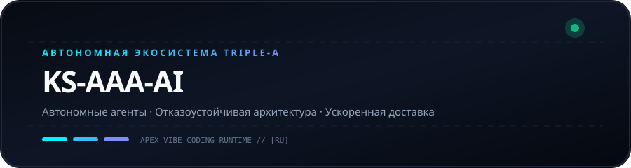
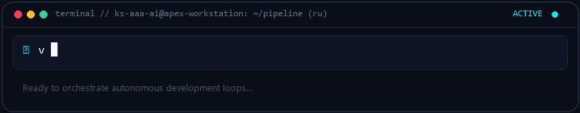
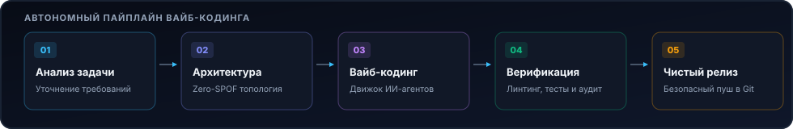

  
  

# KS-AAA-AI

  <strong>Проектирование автономных AI-пайплайнов, отказоустойчивых процессов и сверхбыстрых облачных систем.</strong> 
  Ядро Triple-A: Автономность · Архитектура · Ускорение

  [🇺🇸 English](../README.md) · [🇰🇷 한국어](ko.md) · [🇨🇳 中文](zh-CN.md) · [🇪🇸 Español](es.md) · [🇮🇳 हिन्दी](hi.md) 
  [🇸🇦 العربية](ar.md) · [🇧🇷 Português](pt-BR.md) · **🇷🇺 Русский** · [🇫🇷 Français](fr.md) · [🇮🇩 Bahasa Indonesia](id.md)

  
  
  
  

---

<h3 style="display:inline-block; margin:0; cursor:pointer;">💡 Инженерная философия и ядро Triple-A</h3>

 

  

#### 🤖 Автономный интеллект
Построение автономных агентных циклов и инструментов исполнения от идеи до развертывания.

#### 🏛️ Отказоустойчивая архитектура
Проектирование слабосвязанных микросервисов и топологий без единой точки отказа.

#### ⚡ Ускоренная доставка
Минималистичная философия кода в сочетании с быстрой разработкой для надежных решений.

  

---

<h3 style="display:inline-block; margin:0; cursor:pointer;">🚀 Главный проект: github-org-map</h3>

 

> **[github-org-map](https://github.com/KS-AAA-AI/github-org-map)**  
> Ежедневный автономный картографический движок репозиториев с нулевым разглашением данных HMAC-SHA256.

- **🔄 Automation**: GitHub Actions scheduled daily autonomous cartography
- **🛡️ Zero-Leakage Privacy**: HMAC-SHA256 APEX-VAULT encrypted identifier masking
- **🎨 Visual Telemetry**: Cyberpunk Vector SVG & scanning radar GIF generation
- **⚡ Independent Engine**: Custom TypeScript 5.6 engine without external duplication

  👉 <a href="https://github.com/KS-AAA-AI/github-org-map">Explore Repository</a>

  

---

<h3 style="display:inline-block; margin:0; cursor:pointer;">⚡ Технологический стек и протоколы</h3>

 

`
[Languages]   TypeScript · Python · Go · JavaScript · Bash / PowerShell
[Runtimes]    Node.js · Bun · Deno · Python 3.12+
[Cloud & CI]  GitHub Actions · Docker · Cloudflare Workers / D1 · Vercel
[Engineering] Vibe Coding · Agentic Automation · HMAC-SHA256 Cryptography
`

  

---

<h3 style="display:inline-block; margin:0; cursor:pointer;">📬 Контакты и сотрудничество</h3>

 

Заинтересованы в автономных программных архитектурах или инженерном сотрудничестве?

  <a href="https://github.com/KS-AAA-AI">GitHub Profile</a> · 
  <a href="https://github.com/KS-AAA-AI/github-org-map">github-org-map</a> · 
  <a href="mailto:jo9605208@gmail.com">Send an Email</a>

Copyright © 2026 KS-AAA-AI. All rights reserved.

