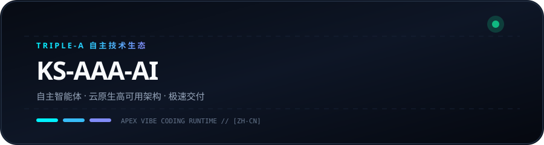
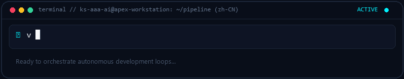
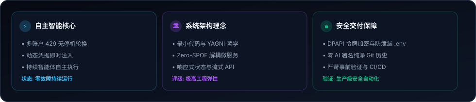
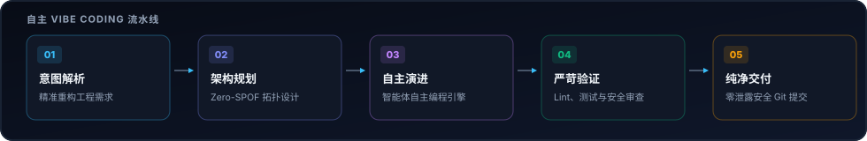

  <picture>
    
  </picture>
  <picture>
    
  </picture>

# KS-AAA-AI

  <strong>构建自主 AI 流水线、高韧性工作流与极速云原生系统。</strong> 
  Triple-A 核心理念：自主智能 · 韧性架构 · 极速交付

  <a href="../README.md">🇺🇸 English</a> · <a href="ko.md">🇰🇷 한국어</a> · <strong>🇨🇳 中文</strong> · <a href="es.md">🇪🇸 Español</a> · <a href="hi.md">🇮🇳 हिन्दी</a> 
  <a href="ar.md">🇸🇦 العربية</a> · <a href="pt-BR.md">🇧🇷 Português</a> · <a href="ru.md">🇷🇺 Русский</a> · <a href="fr.md">🇫🇷 Français</a> · <a href="id.md">🇮🇩 Bahasa Indonesia</a>

  
  
  
  

---

<h3 style="display:inline-block; margin:0; cursor:pointer;">💡 核心理念与 Triple-A 工程哲学</h3>

 

  <picture>
    
  </picture>

#### 🤖 自主智能 (Autonomous Intelligence)
构建无摩擦的自主智能体闭环与智能工具调用执行引擎，实现从创意到生产部署的全流程自动化。

#### 🏛️ 韧性架构 (Resilient Architecture)
设计解耦微服务、无状态运行时以及无单点故障的多账户配额容灾拓扑架构。

#### ⚡ 极速交付 (Accelerated Delivery)
结合极简代码哲学与即时氛围编码工作流，快速交付经过实战检验的高质量产出。

  

---

<h3 style="display:inline-block; margin:0; cursor:pointer;">🚀 核心代表项目：github-org-map</h3>

 

> **[github-org-map](https://github.com/KS-AAA-AI/github-org-map)**  
> 全自动每日代码拓扑测绘引擎，运用 HMAC-SHA256 零知识加密技术对私有仓库进行安全保护。

- **🔄 Automation**: GitHub Actions scheduled daily autonomous cartography
- **🛡️ Zero-Leakage Privacy**: HMAC-SHA256 APEX-VAULT encrypted identifier masking
- **🎨 Visual Telemetry**: Cyberpunk Vector SVG & scanning radar GIF generation
- **⚡ Independent Engine**: Custom TypeScript 5.6 engine without external duplication

  👉 <a href="https://github.com/KS-AAA-AI/github-org-map">Explore Repository</a>

  

---

<h3 style="display:inline-block; margin:0; cursor:pointer;">⚡ 技术栈与协议标准</h3>

 

`
[Languages]   TypeScript · Python · Go · JavaScript · Bash / PowerShell
[Runtimes]    Node.js · Bun · Deno · Python 3.12+
[Cloud & CI]  GitHub Actions · Docker · Cloudflare Workers / D1 · Vercel
[Engineering] Vibe Coding · Agentic Automation · HMAC-SHA256 Cryptography
`

  

---

<h3 style="display:inline-block; margin:0; cursor:pointer;">📬 联系与技术交流</h3>

 

欢迎探讨自主软件架构、工程技术合作或创新系统设计。

  <a href="https://github.com/KS-AAA-AI">GitHub Profile</a> · 
  <a href="https://github.com/KS-AAA-AI/github-org-map">github-org-map</a> · 
  <a href="mailto:jo9605208@gmail.com">Send an Email</a>

Copyright © 2026 KS-AAA-AI. All rights reserved.

